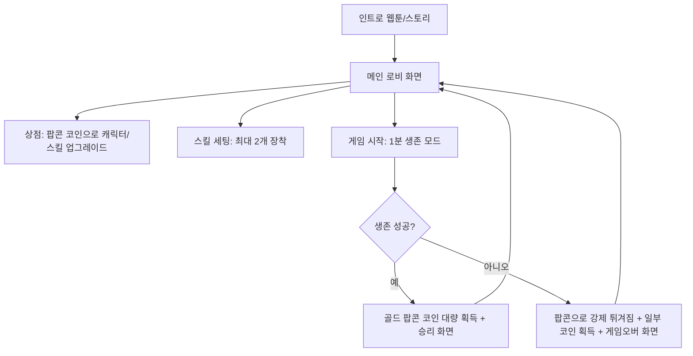

# 말랑 옥수수의 핫팬 탈출! (Soft Corn's Hot Pan Escape)
### 상세 게임 기획서 (Game Design Specification)

본 기획서는 13세 어린이의 원안을 바탕으로, 13~15세 연령층을 타겟으로 한 모바일 웹 캐주얼 서바이벌 게임의 상세 사양을 정의합니다.

---

## 1. 개요 및 핵심 콘셉트 (Game Overview)

*   **게임명**: 말랑 옥수수의 핫팬 탈출! (Soft Corn's Hot Pan Escape)
*   **플랫폼**: 모바일 웹 (Responsive Web, Mobile/Tablet/PC 모두 대응)
*   **장르**: 캐주얼 서바이벌 액션 (Dodge & Survive)
*   **대상 연령**: 13세 ~ 15세
*   **핵심 비주얼**: 트렌디한 카툰 일러스트 스타일, 비비드한 컬러 톤, 프라이팬 열기를 반영한 불타는 효과, 글래스모피즘(Glassmorphism) UI 적용.
*   **핵심 재미 요소**: 
    1.  뜨거워지는 위협(기름, 버터)에 대항해 아슬아슬하게 살아남는 컨트롤의 재미.
    2.  스킬을 상점에서 사전에 장착하고 타이밍에 맞게 사용하는 전략적 재미.
    3.  데미지를 입어 뜨거워질 때 캐릭터가 점차 주황색/빨간색으로 변하다가 결국 하얗게 "팡!" 터지며 팝콘이 되는 유머러스한 비주얼 연출.

---

## 2. 세계관 및 인트로 스토리 (Intro Story & Worldview)

게임 시작 시, 13세 어린이의 초안 스캔본을 기반으로 한 3컷 카드 뉴스 스타일의 컷씬 애니메이션이 재생됩니다. (스킵 가능)

*   **1컷**: 주방 배경. 인자한 인상의 팝콘 장수 할아버지가 노랗고 탱글탱글한 옥수수를 흐뭇하게 바라보며 말합니다.
    > 할아버지: *"오, 옥수수가 아주 잘 익었네! 당장 튀겨볼까?"*
*   **2컷**: 귀여운 손자가 침을 흘리며 할아버지 옆에서 만세를 부릅니다.
    > 아이: *"와아! 할아버지, 팝콘 얼른 만들어 주세요!"*
*   **3컷**: 줌인 효과와 함께 옥수수 알맹이들의 시점으로 전환됩니다. 옥수수알 캐릭터들이 공포에 질려 뜨거운 프라이팬 위로 떨어집니다.
    > 옥수수들: *"으악! 팬이 너무 뜨거워! 버터랑 기름이 밀려온다! 팝콘이 되기 전에 버텨야 해!"*

---

## 3. 핵심 게임 루프 및 흐름도 (Core Game Loop)

---

## 4. 인게임 캐릭터 및 개체 사양 (Game Entities)

### 4.1. 플레이어: 옥수수 알맹이 (Corn Kernel)
*   **기본 능력치**:
    *   **체력 (HP)**: 기본 100. 기름 방울이나 버터와 충돌 시 데미지를 입고 감소.
    *   **이동 속도**: 기본 4 units/frame (상점 업그레이드로 강화 가능).
    *   **스킬 슬롯**: 최대 2개 (상점에서 구매 후 로비에서 장착 가능).
*   **열화 단계별 캐릭터 상태 (HP 비례 비주얼 변화)**:
    *   **1단계 (HP 71% ~ 100%)**: 촉촉하고 노란 '말랑 옥수수' 상태. 웃는 표정.
    *   **2단계 (HP 41% ~ 70%)**: 노란색에서 옅은 주황색으로 익어가며 땀을 흘리는 상태. 걱정스러운 표정.
    *   **3단계 (HP 1% ~ 40%)**: 시뻘갛게 익어서 머리에서 김이 모락모락 나는 상태. 당황하며 소리 지르는 표정.
    *   **4단계 (HP 0% - 사망)**: *"팡!"* 하는 폭발 파티클과 함께 풍성하고 하얀 팝콘 캐릭터로 변하며 화면 위로 승천.

### 4.2. 보스/장애물: 빅버터 (Big Butter)
*   **비주얼**: 네모난 버터 덩어리에 사악하고 게으른 표정이 그려져 있음. 뜨거운 팬 위라 바닥이 살짝 녹아내려 미끄러지는 연출.
*   **행동 패턴**:
    *   화면 가장자리에서 생성되어 반대 방향으로 무작위 돌진 (15초 주기로 돌진).
    *   **버터 트레일**: 빅버터가 지나간 자리에 노란색 '녹은 버터 길'이 3초간 생성됨. 플레이어가 이곳을 밟으면 이동 속도가 40% 감소하고, 초당 5의 지속 데미지를 입음.
    *   빅버터 자체는 공격하여 제거할 수 없는 **무적 장애물**임.

### 4.3. 미니언: 버터 기름 병정 (Butter Oil Soldier)
*   **비주얼**: 노랗고 둥글둥글한 기름 방울 몸체에 투구를 쓰고 작은 창을 들고 있는 귀여운 병정.
*   **행동 패턴**:
    *   게임 화면 사방의 가장자리에서 무한 스폰됨 (스폰 주기는 5초마다 2마리씩 생성, 시간 경과에 따라 스폰 수 증가).
    *   천천히 플레이어를 향해 기어오며 3초마다 작은 기름 총알(Yellow Oil Drop)을 플레이어 방향으로 사격.
    *   **처치 가능**: 플레이어의 액티브 스킬(소금 뿌리기 등)에 닿으면 처치되며, 처치 시 팝콘 파티클을 남김.

---

## 5. 조작법 및 UI/UX (Controls & UI/UX)

### 5.1. 조작법
*   **모바일 웹 (기본)**: 
    *   **가상 조작패드 (Virtual Joystick)**: 화면의 좌측 하단을 터치 후 드래그하여 플레이어 캐릭터를 부드럽게 8방향으로 이동.
    *   **스킬 버튼**: 화면의 우측 하단에 장착된 스킬 아이콘 2개가 배치됨. 클릭 시 즉시 발사 및 쿨타임 UI 연출.
*   **PC 브라우저 (개발/테스트용)**:
    *   `W`, `A`, `S`, `D` 또는 방향키(Arrow Keys)로 이동.
    *   `J`, `K` 키로 각각 1번 스킬, 2번 스킬 사용 가능.

### 5.2. 화면 레이아웃 및 디자인
*   **메인 로비**: 
    *   상단에 현재 보유한 **팝콘 코인** 개수 표시.
    *   중앙에 귀여운 옥수수 캐릭터가 팬 밖에서 쉬고 있는 애니메이션.
    *   하단에 [스킬 장착 창], [상점 가기], [게임 시작] 버튼 배치.
*   **인게임 화면**:
    *   상단 중앙에 60초 타이머와 함께 캐릭터 HP바 배치.
    *   프라이팬 바닥은 열선이 은은하게 붉게 달아오르는 그라데이션 애니메이션 효과 적용.
    *   데미지를 입으면 화면 가장자리가 붉게 깜빡이는 화면 충격 효과 (Vignette Red Effect).
*   **상점 화면**:
    *   네온 테두리와 반투명 유리가 겹쳐진 글래스모피즘 팝업 레이아웃.
    *   업그레이드 항목 클릭 시 귀여운 소리 효과음과 함께 코인이 차감되며 능력치 상승 게이지가 충전되는 연출.

---

## 6. 스킬 및 아이템 상세 사양 (Skills & Shop Upgrades)

### 6.1. 액티브 스킬 (로비에서 최대 2개 장착 가능)

1.  **소금 뿌리기 (Salt Splash)**
    *   **설명**: 옥수수 맛을 돋우는 맛소금을 주변 사방으로 흩뿌립니다.
    *   **효과**: 플레이어 주변 반경 120px 내의 기름 병정들을 소금에 절여 즉사시키고, 날아오는 기름 총알들을 파괴합니다.
    *   **쿨타임**: 6초
2.  **아이스 팩 (Ice Pack)**
    *   **설명**: 시원한 팩을 머리에 얹어 옥수수가 팝콘이 되는 열기를 식힙니다.
    *   **효과**: 플레이어의 HP를 즉시 25 회복하고, 2초 동안 방어력이 50% 증가하여 피격 데미지를 반만 받습니다.
    *   **쿨타임**: 12초
3.  **알맹이 대시 (Kernel Dash)**
    *   **설명**: 플레이어가 조준하고 있는 방향으로 눈부신 속도로 슬라이딩합니다.
    *   **효과**: 0.4초 동안 무적이 되며 경로 상의 모든 기름 병정에게 50의 데미지를 주고 뒤로 밀쳐냅니다.
    *   **쿨타임**: 8초

### 6.2. 상점 영구 업그레이드 (Shop Upgrades)

| 업그레이드 항목 | 설명 | 단계별 효과 | 비용 (팝콘 코인) |
| :--- | :--- | :--- | :--- |
| **두꺼운 껍질 (Max HP)** | 옥수수 알맹이의 껍질을 두껍게 하여 최대 체력을 늘립니다. | Lv.1: 100   Lv.2: 125   Lv.3: 150 (맥스) | Lv.1->2: 50   Lv.2->3: 120 |
| **말랑 부스터 (Speed)** | 이동 속도가 영구히 증가합니다. | Lv.1: 4.0   Lv.2: 4.8   Lv.3: 5.5 (맥스) | Lv.1->2: 60   Lv.2->3: 150 |
| **스킬 강화: 소금** | 소금 뿌리기의 범위와 데미지를 강화합니다. | Lv.1: 기본   Lv.2: 범위 +30%, 쿨다운 -1초 | 100 |
| **스킬 강화: 아이스** | 아이스 팩의 회복량을 증가시킵니다. | Lv.1: 회복량 25   Lv.2: 회복량 40 | 100 |
| **스킬 해금: 대시** | 알맹이 대시 스킬을 해금하여 로비에서 장착할 수 있게 합니다. | 최초 구매 시 영구 해금 | 150 |

---

## 7. 보상 및 재화 밸런스 (Economy Balance)

*   **승리 보상**: 60초 생존 성공 시 100 팝콘 코인 기본 획득 + 생존 중 처치한 기름 병정 1마리당 2 코인 추가 적립.
*   **패배 보상**: 생존한 시간(초) * 1 코인 획득 (예: 45초 생존 시 45 코인).
*   **밸런스 목표**: 평균 3판 정도 플레이하면 능력치를 1회 업그레이드하거나 스킬을 구매할 수 있도록 설계하여 13-15세 유저층의 리플레이 욕구를 자극합니다.
